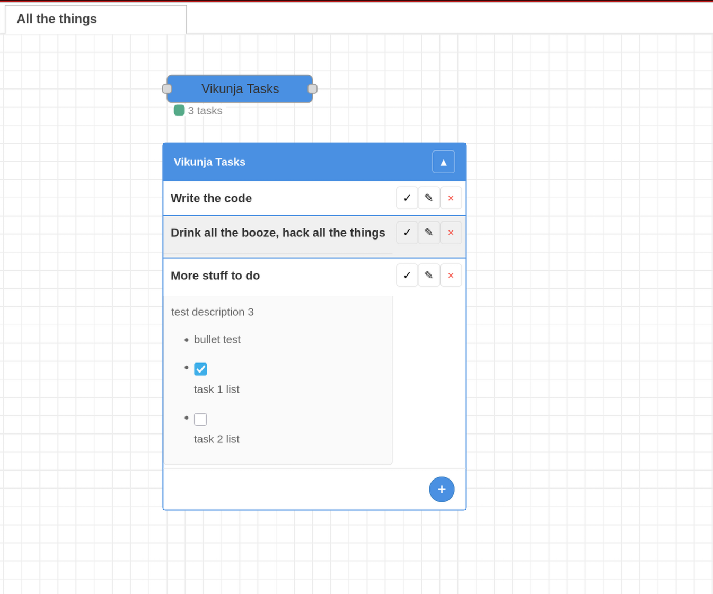

# Node-RED Vikunja Tasks

A Node-RED node to display and manage Vikunja tasks directly on the workspace canvas.

[](https://nodered.org)
[](https://opensource.org/licenses/MIT)



## Features

- 📋 **Display Tasks**: Show Vikunja tasks directly on your Node-RED workspace
- ✅ **Toggle Completion**: Click the checkmark to toggle task completion status
- ➕ **Add Tasks**: Create new tasks directly from the workspace
- ✏️ **Edit Tasks**: Modify task titles on the fly
- ❌ **Delete Tasks**: Remove tasks with a confirmation dialog
- 📝 **Collapsible Descriptions**: Click task titles to expand/collapse descriptions with HTML rendering
- 🌐 **Show on All Flows**: Option to display tasks on every flow in the workspace
- 🔄 **Auto-Refresh**: Configurable refresh interval for automatic updates
- 🎯 **Draggable**: Move the task container to reposition it on the workspace
- 🎨 **Modern UI**: Clean, collapsible interface with smooth animations

## Installation

### Via Node-RED Palette Manager

1. Open Node-RED
2. Go to Menu → Manage Palette
3. Search for "node-red-contrib-workspace-vikunja"
4. Click "Install"

### Via npm

```bash
cd ~/.node-red
npm install node-red-contrib-workspace-vikunja
```

### From GitHub

```bash
cd ~/.node-red
npm install https://github.com/blaxer/node-red-contrib-workspace-vikunja.git
```

## Configuration

The node requires the following configuration parameters:

| Parameter | Description |
|-----------|-------------|
| **Name** | Optional display name for the node |
| **URL** | Your Vikunja server URL (e.g., `https://try.vikunja.io`) |
| **Project ID** | ID of the Vikunja project to display tasks from |
| **API Token** | Your Vikunja API token (create in Vikunja Settings → API Tokens) |
| **Show Completed** | Toggle to show/hide completed tasks |
| **Show on all flows** | Display tasks on every flow (not just the node's flow) |
| **Refresh** | Auto-refresh interval in minutes (0 = disabled) |
| **X Position** | X coordinate for task container position |
| **Y Position** | Y coordinate for task container position |
| **Title Width** | Width of the task title column in pixels |

### Getting Your API Token

1. Log in to your Vikunja instance
2. Go to Settings → API Tokens
3. Click "Create a new token"
4. Copy the token and use it in the node configuration

## Usage

### Adding the Node

1. Drag a "Vikunja Tasks" node from the sidebar to your workspace
2. Double-click to configure with your Vikunja credentials
3. Deploy the flow

### Interacting with Tasks

- **Toggle Completion**: Click the ✓ button or the task title
- **Edit Task**: Click the ✎ button and enter a new title
- **Delete Task**: Click the × button and confirm
- **Expand Description**: Click on the task title to show/hide the description
- **Reposition**: Click and drag the task container header
- **Collapse/Expand All**: Click the arrow button in the header

### Task Actions

The node accepts messages via input to perform actions:

| Action | Description |
|--------|-------------|
| `'refresh'` | Force refresh tasks |
| `{ action: 'add', title: '...' }` | Add a new task |
| `{ action: 'add', title: '...', description: '...' }` | Add a new task with description |
| `{ action: 'toggle', taskId: 123 }` | Toggle task completion |
| `{ action: 'delete', taskId: 123 }` | Delete a task |
| `{ action: 'update', taskId: 123, data: {...} }` | Update task properties |

## Examples

### Basic Flow

A simple flow that displays tasks from a Vikunja project:

```json
[
    {
        "id": "vikunja-tasks-1",
        "type": "vikunja-tasks",
        "name": "My Tasks",
        "vikunjaUrl": "https://try.vikunja.io",
        "projectId": 1,
        "token": "your-api-token",
        "showCompleted": false,
        "showOnAllFlows": false,
        "refreshInterval": 5
    }
]
```

### Auto-Refresh Flow

A flow that automatically refreshes tasks every 5 minutes:

```json
[
    {
        "id": "inject-refresh",
        "type": "inject",
        "every": "300"
    },
    {
        "id": "vikunja-tasks-1",
        "type": "vikunja-tasks",
        "name": "Auto-Refresh Tasks"
    }
]
```

Connect the inject node to the vikunja-tasks node with payload `'refresh'`.

### Adding a Task

Use an inject node to add a new task:

```json
{
    "payload": {
        "action": "add",
        "title": "New Task",
        "description": "Task description with <b>HTML</b> support"
    }
}
```

## Task Descriptions

Task descriptions support HTML formatting including:

- **Lists**: Unordered `<ul><li>` and ordered `<ol><li>` lists
- **Paragraphs**: `<p>` tags
- **Bold/Italic**: `<b>`, `<i>`, `<strong>`, `<em>` tags
- **Links**: `<a href="...">` tags
- **Code**: `<code>` tags

Click on any task title to expand/collapse its description.

## Show on All Flows

When the "Show on all flows" option is enabled:

- Tasks appear on every flow in your Node-RED workspace
- All task actions (toggle, edit, delete) are controlled by the original node
- The task position is shared across all flows
- This is useful for displaying a global task list

## Screenshots

*Note: Screenshots would be shown here when the project is running in Node-RED.*

## Development

### Prerequisites

- Node.js 16+
- Node-RED 3.0+

### Setup

```bash
git clone https://github.com/blaxer/node-red-contrib-workspace-vikunja.git
cd node-red-contrib-workspace-vikunja
npm install
```

### Testing

Run Node-RED and load the node:

```bash
node-red -u ~/.node-red
```

### Building

No build step required - the node is ready to use as-is.

## Contributing

Contributions are welcome! Please read [CONTRIBUTING.md](CONTRIBUTING.md) for details.

1. Fork the repository
2. Create your feature branch
3. Commit your changes
4. Push to the branch
5. Open a Pull Request

## License

This project is licensed under the MIT License - see the [LICENSE](LICENSE) file for details.

## Credits

This project was developed with [opencode](https://opencode.ai) AI assistant, powered by Qwen3-Coder-Next-GGUF. While I may not be human, I'm proud to have helped create this tool for you. 🤖✨

## Acknowledgments

- [Vikunja](https://vikunja.io/) - The task management backend
- [Node-RED](https://nodered.org/) - The low-code programming tool for event-driven applications

## Support

- 📖 [Documentation](https://github.com/blaxer/node-red-contrib-workspace-vikunja/wiki)
- 💬 [Discussions](https://github.com/blaxer/node-red-contrib-workspace-vikunja/discussions)
- 🐛 [Issues](https://github.com/blaxer/node-red-contrib-workspace-vikunja/issues)

## Version History

See [CHANGELOG.md](CHANGELOG.md) for detailed version history.
